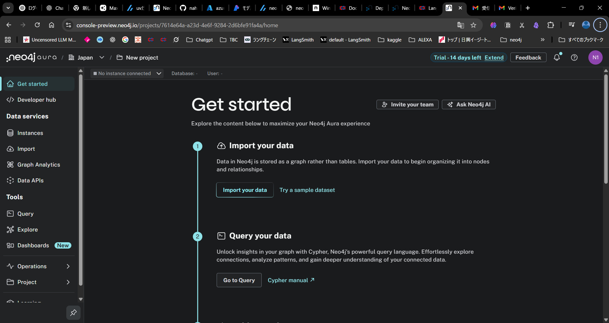

##### 参考
- [Neo4j LLM Knowledge Graph Builderを試す](https://zenn.dev/kun432/scraps/1cdca692b70195)

##### 手順
1. [neo4jaura](https://neo4j.com/product/auradb/)のフリープラン登録
メールアドレス/氏名だけでOK
インスタンスが作成されたことが確認出来たら終了
※パスワードを控えておく

1. [GB GUI環境](https://llm-graph-builder.neo4jlabs.com/)
からURIとパスワードで接続
※チャットの設定で各サーチをセレクトしておく

##### 補足
- 仮アカウント:n16690805@gmail.com